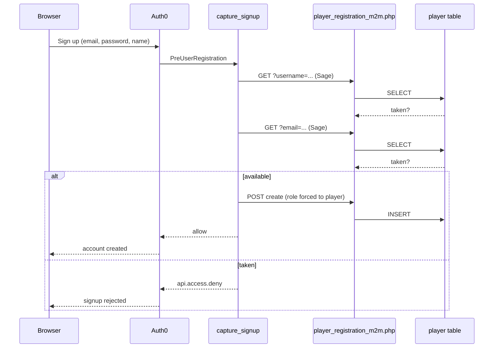
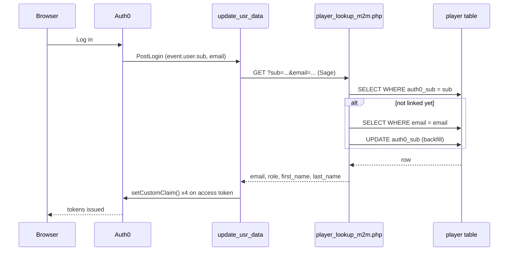
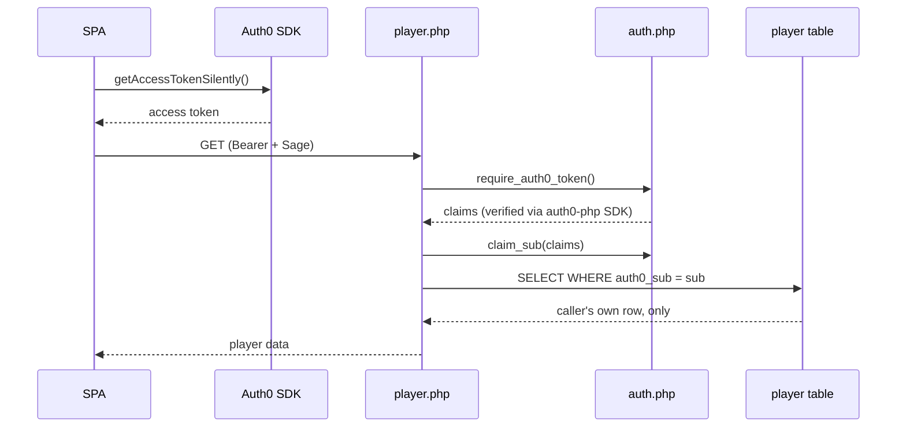

# World of Kothis — Authentication Reference

Auth0 handles who you are. The `player` table is the only source of truth for what you can do. This traces every piece connecting the two — where it lives, why it's shaped that way, and what's still a known gap.

**Stack:** React Router 7 frontend · PHP + `auth0-php` SDK backend · 3 Auth0 Actions · 2 M2M-only endpoints

---

## The mental model

**Auth0 authenticates; your database authorizes.** Auth0 proves someone is who they claim to be and hands back a signed token. Everything about *what they're allowed to do* — their role, their own player record, eventually campaign/character permissions — is decided by looking things up in your own `player` table, not by trusting anything Auth0 says about them beyond their verified identity.

That split is why there are two categories of code in this document: things that establish *who* (the SDK, JWKS, signature checks — all handled by Auth0's own library) and things that decide *what happens next* (the PHP self-lookup logic, the DB-sourced claims, the permission checks — all yours).

## The three actors

| Actor | Role |
|---|---|
| **Frontend** | The React Router SPA. Holds the session, asks Auth0 for tokens, attaches them to API calls. Never trusted with authorization decisions — it just displays whatever the backend agrees to hand over. |
| **Auth0** | Identity provider. Runs login/signup, issues signed tokens, and runs three small pieces of server-side logic (Actions) that bridge into your DB at exactly two moments: registration and login. |
| **Backend** | PHP over MySQL. Verifies every token itself (doesn't take Auth0's word for it blindly), and is the only place that ever reads or writes the `player` table. |

---

## Frontend — Provider & config

### `src/entry.client.tsx`

Wraps the whole app in `<Auth0Provider>` — domain, client ID, and callback URL are read from `src/config/auth.ts` rather than inlined here. `audience` targets your own API (`https://kothis.sylphaxiom.com/api/v1/`), which is what makes the access token usable against your PHP endpoints at all. `useRefreshTokens` + `cacheLocation="localstorage"` are set — that combination is only safe with **Refresh Token Rotation** turned on for the Application in the Auth0 Dashboard, which is worth confirming directly rather than assuming.

`onRedirectCallback` restores the pre-login URL via `window.history.replaceState` once Auth0 finishes processing a login redirect.

### `src/config/auth.ts`

Every `import.meta.env.VITE_*` read in the app funnels through this one file, instead of being scattered across components:

| Export | Backs |
|---|---|
| `AUTH0_DOMAIN` | Auth0Provider's tenant domain |
| `AUTH0_CLIENT_ID` | Auth0Provider's client ID |
| `AUTH0_CALLBACK_URL` | Post-login redirect target — patched dev/test/prod at deploy time by `mods.json` |
| `AUTH0_CONNECTION_ID` | Forced connection on the guarded routes' login prompt |
| `SAGE_SECRET` | The legacy shared-secret header, now scoped to a secondary check — see [M2M endpoints & Sage](#backend--m2m-endpoints--where-sage-still-belongs) |

## Frontend — Route guards & the login UI

### `src/components/utils/withSecured.tsx`

One shared wrapper around `withAuthenticationRequired`, used identically by every gated page — `Home.tsx`, `VaultDoor.tsx`, `Profile.tsx`, `MyCharacters.tsx`. Defaults to the connection ID from `config/auth.ts`; a route can override it, but none currently need to.

### `src/components/utils/LoginRedirect.tsx`

The `/login` route's element — wrapped in `withSecured` so visiting it directly triggers a real `loginWithRedirect()` through the SDK (correct PKCE + state handling). Replaced an earlier version that hand-built an `/authorize` URL with no `state` param — the SDK's own redirect-callback handler requires one, so that path could never actually complete a login.

### `src/components/utils/useAuthActions.ts`

One hook for login / logout / sign-up / go-to-profile, shared by both places the login menu is rendered — the desktop SpeedDial (`Login.tsx`) and the mobile/tablet AppBar menu (`Layout.tsx`). These used to be two separately hand-written copies that had quietly drifted (different logout redirect target, one cleared all of `localStorage` and the other didn't).

## Frontend — Sending the token

### `src/components/workhorse/Queries.ts`

**`fetchPlayer(isAuthenticated, getAccessTokenSilently, username?, email?)`**
Calls `getAccessTokenSilently()`, sends it as `Authorization: Bearer` plus the legacy `Sage` header to `GET player.php`. The `username`/`email` params are still accepted for signature compatibility but are ignored server-side now — see [the identity-linking fix](#backend--the-identity-linking-fix). Normalizes any non-`"success"` response to `null`, since the PHP side returns `message` as a plain string (not a `Player[]`) on failure.

**`updatePlayer(getAccessTokenSilently, formData)`**
Same auth pattern, `PATCH` instead. Sends only `fname`/`lname`/`email` — the file field in the form is deliberately excluded (see [known gaps](#known-gaps--accepted-tradeoffs)).

`ProfileDataForm.tsx` calls `updatePlayer` from its own `onSubmit`, not through a React Router `clientAction` — a `clientAction` runs outside component context, so it has no way to call the `useAuth0()` hook for a token. Handling the submit inside the component keeps that available.

---

## Backend — Verifying the token

`src/api/v1/auth.php` — every user-facing endpoint starts here.

Uses Auth0's own `auth0/auth0-php` SDK rather than hand-rolled JWT/JWKS handling — the SDK owns fetching and caching Auth0's signing keys and checking signature, expiry, issuer, and audience. Pinned to `^8.0` deliberately (9.x shipped very close to this decision, without a verified working example to build against).

| Function | Does |
|---|---|
| `verify_auth0_token(): ?array` | Reads `Authorization: Bearer`, calls `$auth0->decode(..., Token::TYPE_TOKEN)`, returns the decoded claims or `null`. |
| `require_auth0_token(): array` | 401s on failure. Called unconditionally at the top of `player.php`, before the method switch — no request reaches any business logic without a verified token. |
| `claim_email(claims): ?string` | Reads the namespaced custom claim `https://kothis.sylphaxiom.com/email` — only present because the Post-Login Action attaches it. Used for display/uniqueness purposes now, not identity linking. |
| `claim_sub(claims): ?string` | Reads the standard `sub` claim — present on every token automatically, no Action required, and never changes for a given account. This is the actual identity key now. |
| `require_permission(permission, claims): void` | Checks the token's Auth0-native `permissions` claim, 403s if missing. Defined and ready, but not currently called by `player.php` — see [RBAC](#auth0--permissions-rbac). |

## Backend — The identity-linking fix

Why `email` was the wrong join key, and what replaced it.

The first working version linked "this Auth0 login" to "this DB row" by matching email addresses. It worked — until a player used the app's own profile form to change their email. The DB row changed; Auth0's own copy of that email did not (the two systems were never connected for writes). On the next login, the lookup-by-email came up empty, no claim got attached, and every self-lookup downstream 404'd.

The fix: `sub` — Auth0's permanent user ID — doesn't have this problem. It's on every token by default, and nothing the user does in your app or in Auth0 can change it.

**Migration shape:**
1. Add a nullable, unique `auth0_sub` column to `player` (`kothis.DB_make.sql`).
2. `player_lookup_m2m.php` tries `auth0_sub` first; if that misses and an `email` was also passed, it falls back to an email match — and if *that* hits, backfills `auth0_sub` onto the row right then.
3. `player.php`'s own self-lookup (GET and PATCH) now matches on `claim_sub($claims)` against `auth0_sub`, never email.

Net effect: every existing player links up automatically on their next login (via the one-time email fallback), and from then on the link survives any number of email changes. The accepted tradeoff is that Auth0's own stored email can now silently diverge from the DB's — see [known gaps](#known-gaps--accepted-tradeoffs).

## Auth0 — Permissions (RBAC)

Native Auth0 RBAC is enabled and populated, but not yet load-bearing on the endpoint that exists today.

RBAC + "Add Permissions in the Access Token" are enabled on the API, and 19 permissions are defined — resource-scoped around campaign, character, and homebrew content:

| Resource | Scopes defined |
|---|---|
| `campaign` | read:gm, read:member, edit:gm, edit:member, create |
| `character` | read:self, read:campaign, read:public, edit:self, edit:campaign, edit:public, create |
| `homebrew` | read:self, read:public, read:campaign, edit:self, edit:campaign, edit:public, create |

None of these cover the *player account* record itself (email/username/role) — that's a deliberate gap, not an oversight: nobody, including a GM or admin, is meant to read or edit someone else's raw account through `player.php`. That endpoint uses a simpler rule instead — **self-only, no exception** — rather than a permission check. `require_permission()` sits ready in `auth.php` for whenever campaign/character/homebrew endpoints get built, since the permission set above already matches that shape.

---

## Auth0 — The three Actions

Server-side code Auth0 runs at two specific moments — not part of this repository, but reproduced here for reference.

### PreUserRegistration — `capture_signup`

Runs *before* the Auth0 account exists — there is no possible token to check at this point, for anyone. Validates the custom signup form's first/last name fields, denies the signup if either is missing. Sets `usr-role` app_metadata to `player` unconditionally — **this is informational only, not an Auth0 RBAC Role assignment** (see the gap note below). Checks username and email availability, then creates the row — all three calls go to `player_registration_m2m.php` (Sage-only; see [M2M endpoints](#backend--m2m-endpoints--where-sage-still-belongs)). The DB role is hardcoded to `player` server-side regardless of what's sent, so registration can never self-assign anything higher.

### PostLogin — `update_usr_data`

Runs on every login *and* on refresh-token exchanges. Calls `player_lookup_m2m.php` with `sub` (`event.user.user_id`) plus `email` as a fallback. On a match, attaches `email`, `role`, `first_name`, `last_name` as namespaced claims on the **access token** — not the ID token, so none of this is visible client-side via `useAuth0().user` without separately deciding to add it there too.

### Unreviewed — "Rules (legacy)"

Sits in the Post Login flow, ahead of `update_usr_data`. Never opened or audited during this work — flagged, not cleared. See [known gaps](#known-gaps--accepted-tradeoffs).

## Backend — M2M endpoints & where Sage still belongs

The one legitimate remaining use of the old static-secret pattern.

The original design's core flaw was a static `Sage` secret, shipped in browser JS, acting as the *only* check on user-facing requests. That's gone — `player.php` now requires a real verified token and never accepts Sage as a substitute. But two callers genuinely have no user token to present, because they run *before one could exist*: an Action executing during signup or login. For exactly those two, a secret held server-side in Auth0's own secrets vault (never shipped anywhere near a browser) is the correct tool, not a workaround.

| Endpoint | Called by | Does |
|---|---|---|
| `player_lookup_m2m.php` | update_usr_data | Sub-first, email-fallback-with-backfill lookup (GET only) |
| `player_registration_m2m.php` | capture_signup | Username/email availability check (GET), row creation (POST) — role always hardcoded |

Both are gated on Sage alone, deliberately, and both refuse to be anything the SPA could call directly — no CORS opened up, no path any frontend code touches.

---

## End-to-end flows

### Registration

### Login

### Authenticated request — reading the profile

Client-supplied username/email query params are accepted for backward compatibility but never consulted — the row returned is always resolved from the verified token, never from the request.

---

## Known gaps & accepted tradeoffs

Said out loud on purpose — a good architecture review names its own edges.

- **Auth0's stored email can diverge from the DB's.** Editing your profile updates `player.email` only. Auth0's own copy stays whatever it was at signup (or last changed through Auth0 directly). Fine today since login is username-based for most users; would matter the moment an email-based Auth0 flow (password reset, verification) gets relied on more.

- **Profile image upload doesn't work.** The form field exists and is disabled on purpose. PHP doesn't populate `$_FILES` for PATCH requests the way it does for POST — this needs a manual multipart parser (or switching the action to POST) before it can do anything at all.

- **New users never get an actual Auth0 RBAC Role assigned.** `capture_signup` sets `usr-role` app_metadata to `player` — a plain data field, unconnected to the real Auth0 Roles that carry the 19 permissions from [RBAC](#auth0--permissions-rbac). Assigning one of those actual Roles takes either a manual step per user in the Dashboard right now, or a Management API call this Action doesn't make yet (a separate token grant — more machinery to add). Until that's built, every new signup has no permissions attached at all unless someone assigns a Role by hand.

- **Refresh Token Rotation — never explicitly confirmed on.** `cacheLocation="localstorage"` is only Auth0's recommended-safe pattern when Refresh Token Rotation is enabled for the Application in the Dashboard. Worth checking directly rather than assuming.

- **The legacy "Rules" node is unreviewed.** Runs ahead of `update_usr_data` in the Post Login flow. Not opened, not audited, not confirmed harmless during this work.

- **`player.php`'s own POST case is now dead code.** Registration goes through `player_registration_m2m.php` instead. Nothing calls `player.php`'s POST anymore — a candidate for retiring, not yet done.

- **Cosmetic: the DB calls the GM role `dm`.** The product vision uses "GM." Purely a naming mismatch — no urgency, but it'd touch the enum, `SecureForms.tsx`, and any UI copy if it's ever worth fixing.

---

## File map

| File | Layer | Role |
|---|---|---|
| `entry.client.tsx` | Frontend | Auth0Provider setup, redirect callback |
| `config/auth.ts` | Frontend | Centralized env constants |
| `utils/withSecured.tsx` | Frontend | Shared route guard |
| `utils/useAuthActions.ts` | Frontend | Shared login/logout/signup actions |
| `utils/LoginRedirect.tsx` | Frontend | /login route trigger |
| `workhorse/Queries.ts` | Frontend | fetchPlayer / updatePlayer |
| `forms/ProfileDataForm.tsx` | Frontend | Profile edit form |
| `workhorse/SecureForms.tsx` | Frontend | Client-side role-tier UI gates (display only, not a security boundary) |
| `api/v1/auth.php` | Backend | Token verification, claim helpers, permission check |
| `api/v1/player.php` | Backend | User-facing, self-only profile GET/PATCH |
| `api/v1/player_lookup_m2m.php` | Backend | Sage-only, sub-first lookup for login |
| `api/v1/player_registration_m2m.php` | Backend | Sage-only, availability check + creation for signup |
| `api/v1/composer.json` / `vendor/` | Backend | auth0-php SDK + Guzzle, deployed like bucket.php (not in git) |
| `api/v1/kothis.DB_make.sql` | Backend | Schema reference, including `auth0_sub` |
| `api/v1/bucket.php` | Backend | Sage secret + DB credentials (gitignored, not in repo) |
| capture_signup | Auth0 | PreUserRegistration Action |
| update_usr_data | Auth0 | PostLogin Action |
| Rules (legacy) | Auth0 | Unreviewed — see known gaps |
